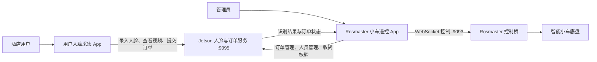

# 智能小车双端 Android 应用

[](https://github.com/RongStarD/android-car-control/actions/workflows/android-ci.yml)
[](https://github.com/RongStarD/android-car-control/actions/workflows/android-cd.yml)

本仓库是酒店智能配送小车项目的最终 Android 客户端交付仓库。最终成品由两个相互配合、可独立构建和安装的原生 Android App 组成：

- [`face-enrollment-app`](face-enrollment-app/)：面向酒店用户，完成人脸录入、实时查看与商品下单。
- [`rosmaster-control-app`](rosmaster-control-app/)：面向管理员，完成小车遥控、订单配送、人脸库管理与收货核验。

两个 App 当前版本均为 `1.4.0`，使用 Kotlin、Jetpack Compose 和 OkHttp 开发，支持 Android 8.0（API 26）及以上设备。

> 仓库根目录的 `app/`、`gradle/` 及根级 Gradle 配置属于早期单 App 工程，仅保留历史代码，不作为最终成果构建或交付。最终验收请以以上两个独立目录为准。

## 业务流程



一次完整配送流程如下：

1. 用户在“用户人脸采集”App 中拍照或从相册选择照片，录入人脸。
2. 用户选择商品、填写房间号并提交订单，订单同时绑定人员 ID 和姓名。
3. 管理员在“Rosmaster 小车遥控”App 中查看订单并开始配送。
4. 管理员通过 WebSocket 控制小车前进、后退、平移、转向或寻迹。
5. 小车到达后，管理员启动 5 秒收货人识别。
6. 服务端确认识别人员与订单绑定人员一致后，原子地将订单标记为已完成。

## 最终 App

### 用户人脸采集 App

目录：[`face-enrollment-app/`](face-enrollment-app/)

主要功能：

- 使用系统相机或 Photo Picker 采集最多 10 张人脸样本，处理 EXIF 方向、尺寸与文件大小后上传。
- 连接 Jetson `9095` 服务，查看 MJPEG 实时画面并发起 5 秒按需人脸识别。
- 录入或替换同名人员样本；人员库的查看和删除由管理员端统一完成。
- 从服务端读取可售商品，支持多选、数量调整、房间号校验和订单提交。
- 订单绑定最近成功录入的 `person_id`，避免仅靠同名字符串关联人员。
- App 进入后台时释放视频连接并停止状态轮询，状态变更请求不会自动重放。

详细说明：[face-enrollment-app/README.md](face-enrollment-app/README.md)

### Rosmaster 小车遥控 App

目录：[`rosmaster-control-app/`](rosmaster-control-app/)

主要功能：

- 通过 `ws://<Jetson-IP>:9093` 控制小车移动、停车、紧急停止和寻迹。
- 提供 `30 / 50 / 70 / 100` 四档速度，以及持续、`0.5s`、`1s` 三种运动时长。
- 查看 `9095` 服务提供的 MJPEG 视频、识别状态、人脸数据库与人员列表。
- 管理待完成、配送中、已完成和已取消订单，并限制同时只能有一个配送中订单。
- 将配送订单绑定到 5 秒人脸识别会话，核验收货人后自动完成订单。
- 通过心跳租约、松手停车、后台停车、断线停车和服务端看门狗降低失控风险。

仓库同时包含可部署到 Jetson 的独立控制桥：[`rosmaster-control-app/jetson/`](rosmaster-control-app/jetson/)。

详细说明：[rosmaster-control-app/README.md](rosmaster-control-app/README.md)

## 系统要求与网络端口

### Android 构建环境

- Android Studio（支持 Android Gradle Plugin 8.x）
- JDK 17
- Android SDK 35
- 最低运行版本：Android 8.0 / API 26

### Jetson 服务

| 端口 | 协议 | 用途 | 使用方 |
| ---: | --- | --- | --- |
| `9093` | WebSocket | 小车运动、停止、寻迹与状态同步 | 小车遥控 App |
| `9095` | HTTP / MJPEG | 人脸录入、识别、视频、商品目录和订单 | 两个 App |

手机与 Jetson 必须位于可互访的受控局域网中。默认 Jetson 地址为 `10.39.132.165`，可在 App 中根据现场网络修改。

控制桥默认不占用摄像头，只监听 `9093`；摄像头和识别视频由 `9095` 服务统一负责。控制桥与厂商桌面控制程序不能同时访问底盘串口。

## 构建两个 App

两个目录都是独立 Gradle 工程，请分别用 Android Studio 打开或在各自目录执行命令。

构建前需要通过环境变量、Gradle 属性，或各项目不纳入 Git 的 `local.properties` 配置与 Jetson 一致的 API Key：

```properties
FACE_API_KEY=<测试或现场使用的 API Key>
```

PowerShell 构建命令：

```powershell
cd face-enrollment-app
.\gradlew.bat testDebugUnitTest lintDebug assembleDebug --no-daemon --console=plain

cd ..\rosmaster-control-app
.\gradlew.bat testDebugUnitTest lintDebug assembleDebug --no-daemon --console=plain
```

生成的 Debug APK 分别位于：

```text
face-enrollment-app/app/build/outputs/apk/debug/app-debug.apk
rosmaster-control-app/app/build/outputs/apk/debug/app-debug.apk
```

Debug APK 只适合开发、测试和现场验收。正式分发必须使用团队自己的 Release keystore 签名。

## Jetson 启动

将 [`rosmaster-control-app/jetson/`](rosmaster-control-app/jetson/) 复制到 Jetson 的独立目录后启动控制桥：

```bash
cd ~/rosmaster-control-bridge
bash start_bridge.sh
sudo face-control start
```

停止服务：

```bash
bash scripts/stop.sh
sudo face-control stop
```

部署前请阅读 [Jetson 控制桥说明](rosmaster-control-app/jetson/README.md)；首次实车测试应架空车轮、预留安全空间，并先验证紧急停止。

## CI/CD

- **Final Apps CI**：当两个最终 App 或 CI 工作流发生相关变更并推送到 `main`、创建 Pull Request，或被手动触发时，并行执行单元测试、Android Lint 和 Debug APK 构建。构建产物保留 14 天。
- **Final Apps CD**：支持手动触发，并每 30 分钟基于 `main` 最新代码构建一次两个 Debug APK，生成带 SHA-256 校验文件的 `final-apps-delivery`，产物保留 30 天。
- **正式发布**：推送形如 `v1.4.0` 的标签后，工作流使用仓库 Secrets 构建签名 Release APK，并创建同名 GitHub Release。

查看运行记录：[GitHub Actions](https://github.com/RongStarD/android-car-control/actions)。签名密钥与发布凭据配置见 [CICD.md](CICD.md)。

## 文档索引

| 文档 | 内容 |
| --- | --- |
| [face-enrollment-app/README.md](face-enrollment-app/README.md) | 用户端功能、API、构建与验证说明 |
| [rosmaster-control-app/README.md](rosmaster-control-app/README.md) | 管理端功能、安全规则、实车启动与构建说明 |
| [CONTROL_PROTOCOL.md](rosmaster-control-app/CONTROL_PROTOCOL.md) | Android 与 `9093` 控制桥的 WebSocket JSON 协议 |
| [jetson/README.md](rosmaster-control-app/jetson/README.md) | Jetson 控制桥安装、运行、模拟与安全设计 |
| [CICD.md](CICD.md) | CI、定时交付和正式签名发布配置 |

## 安全与凭据

- 不要提交 `FACE_API_KEY`、Release keystore、密码、SSH 凭据或厂商授权内容。
- `local.properties` 已被 Git 忽略，但编译后的 APK 仍会包含构建时注入的 API Key，只应安装在受控设备上。
- `9093` 控制协议没有账号认证，只能部署在受控局域网，禁止直接暴露到公网。
- App 端的停车保护不能替代 Jetson 控制桥的租约、看门狗和串口独占保护。
